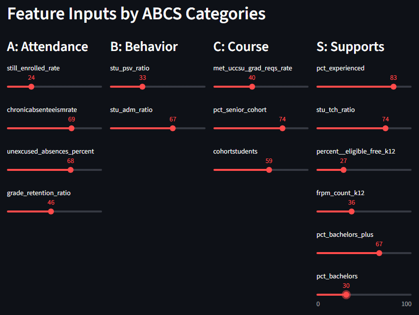
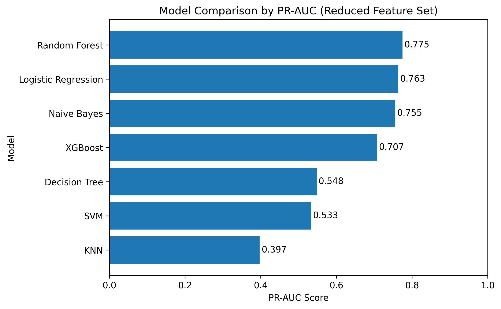

# 🚀 California School-Level Early Warning System (EWS) for Predicting Graduation Outcomes

_A Machine Learning Approach to Identifying At-Risk California Public High Schools Using Public, Non-PII Data_

This project is a part of the ADS-599 course in the Applied Data Science Program at the University of San Diego.


-- **Project Status: Active**

# 📦 Installation

To use this project, first clone the repo on your device using the command below:

```bash
git init
git clone https://github.com/junclemente/msads_capstone.git
```

## 🧪 Environment Setup

This project uses a conda environment specified in a YAML file for
reproducibility and consistent development. Ensure you have
[Anaconda](https://www.anaconda.com/download) or
[Miniconda](https://www.anaconda.com/docs/getting-started/miniconda/main)
installed.

**Create the Environment**  
Run the following:

```bash
conda env create -f environment.yml
```

**Update the Environment (if needed)**  
If there are any updates to the environment, you can update the environment with the following:

```bash
conda env update -f environment.yml --prune
```

The `--prune` option cleans the environment by removing packages that are no longer required.

# 📁 Project Structure

```
msads_capstone/
├── app/
├── data/
├── docs/
├── library/
├── media/
├── models/
├── other_material/
├── .github/
├── environment.yml
├── main_notebook.ipynb
├── CONTRIBUTING.md
├── LICENSE
└── README.md
```

# ▶️ How to Run the Streamlit App

## 🌐 Run the Web Version

Click the following link to run the web version: [http://ca-early-warning-system.streamlit.app](http://ca-early-warning-system.streamlit.app)

### Webapp Key Features

<p align="center">

</p>

🎯 School-Level Graduation Risk Prediction
Users can interactively adjust key predictors to instantly estimate whether a school is At Risk or On Track.

📊 Real-Time Model Output  
The app automatically displays:

- Predicted risk category
- Model confidence / probability

🧮 Interactive Scenario Exploration
Users can simulate “what-if” scenarios such as:

- What if chronic absenteeism decreases?
- What if FRPM eligibility drops by 10%?
- How does the student-to-support-staff ratio impact graduation outcomes?

## 💻 Run locally

1. Clone this repository.
2. Create the conda environment.
3. Activate the conda environment and run the streamlit application:
   ```bash
   conda activate capstone
   streamlit run app/Home.py
   ```

# 🎯 Project Intro / Objective

The main purpose of this project is to develop a school-level Early Warning System (EWS) that identifies California public high schools at risk of low graduation outcomes using only public, non-PII datasets. By leveraging statewide indicators aligned with the ABC framework—Attendance, Behavior, and Course performance—this project demonstrates that actionable early-warning signals can be generated without relying on restricted student-level records.

The goal is to provide California educators, policymakers, and district leaders with a scalable, transparent, and privacy-preserving tool for monitoring emerging risk, understanding systemic inequities, and supporting data-informed planning and resource allocation.

# 👥 Partner(s)/Contributor(s)

- [Amayrani Balbuena](https://github.com/amayranib)
- [Jun Clemente](https://github.com/junclemente)
- [Tanya Ortega](https://github.com/tanyaort)

# 🛠️ Methods Used

<table style="width: 100%; border-spacing: 20px 0;">
<tr>
<td style="vertical-align: top; width: 50%; padding: 10px;">

- Data Cleaning & Preprocessing
- Exploratory Data Analysis (EDA)
- Feature Engineering

</td>
<td style="vertical-align: top; width: 50%; padding: 10px;">

- Predictive Modeling & ML Classification
- Feature Selection using Random Forest
- Data Visualization

</td>
</tr>
</table>

# 🧰 Technologies

<table style="width: 100%; border-spacing: 20px 0;">
<tr>
<td style="vertical-align: top; width: 50%; padding: 10px;">

- Python
- Pandas
- Numpy
- Matplotlib
- Seaborn

</td>
<td style="vertical-align: top; width: 50%; padding: 10px;">

- Jupyter Notebook
- VSCode
- Streamlit
- Conda
- Git / GitHub

</td>
</tr>
</table>

# 📘 Project Description

This project develops a simplified Early Warning System (EWS) that predicts high-school graduation outcomes using only publicly accessible datasets from the California Department of Education (CDE). Using 2021–22 school-level indicators—such as graduation rates, chronic absenteeism, FRPM eligibility, teacher experience, and school characteristics—combined with county-level climate data, we built a cleaned modeling dataset of 958 schools and 25 predictors. A binary target (“At Risk” < 90% graduation rate) highlighted a 26.3% minority class, and analysis confirmed strong ABC-aligned patterns between absenteeism, socioeconomic disadvantage, teacher experience, and graduation outcomes. Multiple machine learning models were evaluated with PR-AUC, Precision, Recall, and F1 due to class imbalance; Random Forest and Logistic Regression performed best, with top predictors including chronic absenteeism, unexcused absences, FRPM eligibility, still-enrolled rate, and A–G completion rate. Key challenges included inconsistent county reporting, FERPA-related suppression, and missing climate indicators, though all data were aggregate and fully public.

# 📊 Dataset Summary

This project integrates multiple publicly accessible, non-PII datasets from the California Department of Education (CDE) and CalSCHLS to build a unified school-level dataset for modeling graduation outcomes. All data represent the 2021–22 school year, except for the CalSCHLS climate data (2017–19), which is the most recent available.

## 📁 Final Modeling Dataset

- **Total schools:** 958 California public high schools
- **Predictor variables:** 25 engineered and cleaned features
- **Target variable:**
  - **At Risk (1):** Graduation rate < 90%
  - **On Track (0):** Graduation rate ≥ 90%
- **Class balance:**
  - _On Track: 73.7%_
  - _At Risk: 26.3%_

## 🌐 Raw Data Sources

Below are the official public websites where all raw datasets used in this project can be downloaded:

<table style="width: 100%; border-spacing: 20px 0;">
<tr>
<td style="vertical-align: top; width: 50%; padding: 10px;">

- **Adjusted Cohort Graduation Rate (ACGR)**  
  https://www.cde.ca.gov/ds/ad/filesacgr.asp

- **Absenteeism / Chronic Absenteeism**  
  https://www.cde.ca.gov/ds/ad/filessabd.asp

- **Absenteeism by Reason**  
  https://www.cde.ca.gov/ds/ad/filessabd.asp

- **Public Schools & Districts (School Directory)**  
  https://www.cde.ca.gov/ds/si/ds/pubschls.asp

- **Free or Reduced-Price Meals (FRPM)**  
  https://www.cde.ca.gov/ds/sd/sd/filessp.asp

- **CBEDS – School & District Information**  
  https://www.cde.ca.gov/ds/ad/filescbedsorab.asp

</td>
<td style="vertical-align: top; width: 50%; padding: 10px;">  

- **Student–Staff Ratios**  
  https://www.cde.ca.gov/ds/ad/fsstrat.asp

- **Staff Education**  
  https://www.cde.ca.gov/ds/ad/fssted.asp

- **Staff Experience**  
  https://www.cde.ca.gov/ds/sd/sd/fsstex.asp

- **Enrollment by School**  
  https://www.cde.ca.gov/ds/ad/enrolldowndata.asp

- **CalSCHLS / School Safety & Climate (County-Level Data)**  
  https://calschls.org/reports-data/query-calschls/
</td>
</tr>
</table> 

## 🏆 Results

Using the top-15 features selected through Random Forest feature importance, seven classification models were evaluated on a stratified test set (20% split). Performance was compared using the PR-AUC as the primary metric due to class imbalance, with Precision, Recall, and F1-Score also included.

**Model Comparison (PR-AUC)**

The highest performing models were:

- **Random Forest** - PR-AUC 0.775
- **Logistic Regression** - PR-AUC 0.763
- **Naive Bayes** - PR-AUC 0.755

**Overall Finding**

Interpretability of the chosen model was not the highest priority since the predictions do not directly impact individual students. The **Random Forest** model delivered the strongest balance of precision and recall and the highest PR-AUC, making it the most reliable classifier for identifying schools `At Risk` of low graduation rates.

<p align="center"> 

</p>

## 📈 Models Compared

The following models were tested to compare predictive effectiveness under class imbalance conditions using PR-AUC as the primary evaluatoin metric.

- Logistic Regression
- Naive Bayes
- Random Forest
- XGBoost
- SVM
- Decision Tree
- KNN

Summary of model performance:  
| Model | Precision | Recall | F1-Score | PR-AUC |
| ----------------------- | --------- | --------- | -------- | --------- |
| **Random Forest** | 0.720 | 0.706 | 0.713 | **0.775** |
| **Logistic Regression** | 0.549 | **0.765** | 0.639 | **0.763** |
| **Naive Bayes** | 0.547 | 0.686 | 0.609 | **0.755** |
| XGBoost | 0.702 | 0.647 | 0.673 | 0.707 |
| Decision Tree | 0.500 | 0.725 | 0.592 | 0.548 |
| SVM | **1.000** | 0.059 | 0.111 | 0.533 |
| KNN | 0.517 | 0.294 | 0.375 | 0.397 |

# 📄 License

This project is licensed under the [MIT License](./LICENSE).

# 🙏 Acknowledgments

We thank the University of San Diego’s Applied Data Science faculty for their support and feedback throughout the ADS-599 Capstone. We also acknowledge the California Department of Education (CDE) for providing publicly accessible datasets on graduation outcomes, absenteeism, staffing, and school demographics, as well as the CalSCHLS/WestEd teams for making county-level school climate data publicly available. Their commitment to open data enabled us to build a fully reproducible, school-level Early Warning System.

We also appreciate the collaborative contributions of our teammates—Amayrani Balbuena, Tanya Ortega, and Jun Clemente—in data collection, analysis, modeling, and application development.

# 🤖 AI Assistance Disclosure

Portions of this project, including selected code snippets, debugging suggestions, and explanatory text, were developed with the assistance of ChatGPT by OpenAI. The authors used AI tools to accelerate brainstorming, refine documentation, and troubleshoot code behavior.

All AI-generated material was manually reviewed, tested, and edited by the authors to ensure correctness, accuracy, and alignment with the project requirements.

# 📚 References

Austin, G., Hanson, T., Bala, N., & Zheng, C. (2023). Student engagement and well-being in California, 2019-21: Results of the Eighteenth Biennial State California Healthy Kids Survey, Grades 7, 9, and 11. WestEd. https://data.calschls.org/resources/18th_Biennial_State_1921.pdf

California Department of Education. (n.d.). Retrieved October 26, 2025, from https://www.cde.ca.gov/

Chen, T., Wanberg, R. C., Gouioa, E. T., Brown, M. J. S., Chen, J. C.-Y., & Kurt Kraiger, J. J. (2019). Engaging parents Involvement in K – 12 Online Learning Settings: Are We Meeting the Needs of Underserved Students? Journal of E-Learning and Knowledge Society, Vol 15 No 2 (2019): Journal of eLearning and Knowledge Society. https://doi.org/10.20368/1971-8829/1563

Cobb, C. D. (2020). Geospatial Analysis: A New Window Into Educational Equity, Access, and Opportunity. Review of Research in Education, 44(1), 97–129. https://doi.org/10.3102/0091732X20907362

Rumberger, R., Addis, H., Allensworth, E., Balfanz, R., Bruch, J., Dillon, E., Duardo, D., Dynarski, M., Furgeson, J., Jayanthi, M., Newman-Gonchar, R., Place, K., & Tuttle, C. (2017). Preventing Dropout in Secondary Schools (No. NCEE 2017-4028). National Center for Education Evaluation and Regional Assistance (NCEE), Institute of Education Sciences, U.S. Department of Education. https://whatworks.ed.gov

Sava, S., Bunoiu, M., & Malita, L. (2017). Ways to Improve Students’ Decision for Academic Studies. Acta Didactica Napocensia, 10(4), 109–120. https://doi.org/10.24193/adn.10.4.11

Siegle, D., Gubbins, E. J., O’Rourke, P., Langley, S. D., Mun, R. U., Luria, S. R., Little, C. A., McCoach, D. B., Knupp, T., Callahan, C. M., & Plucker, J. A. (2016). Barriers to Underserved Students’ Participation in Gifted Programs and Possible Solutions. Journal for the Education of the Gifted, 39(2), 103–131. https://doi.org/10.1177/0162353216640930

The California School Climate, Health, and Learning Survey (CalSCHLS) System—Home. (n.d.). Retrieved October 26, 2025, from https://calschls.org/
